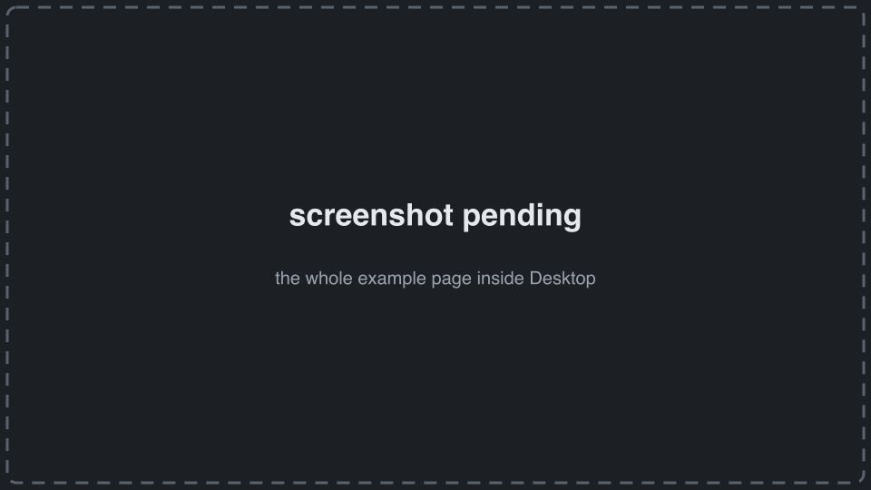
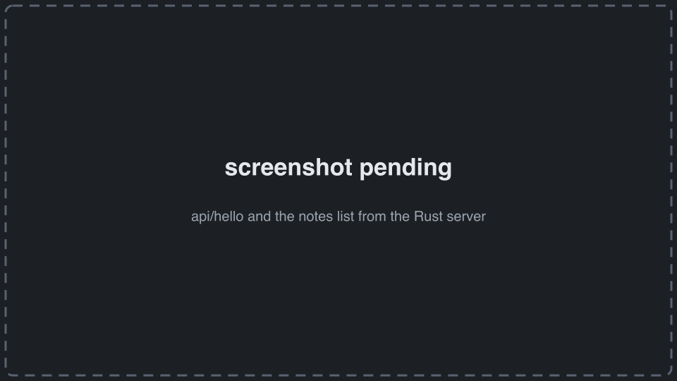
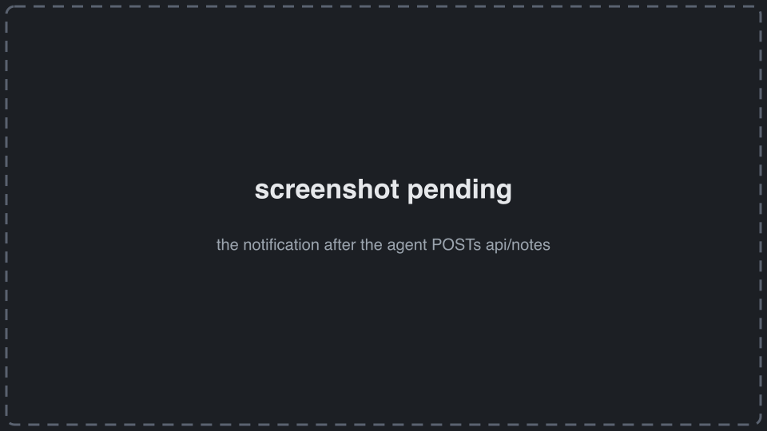

# dim-example-rust

```sh
dimos-desktop install github.com/jeff-hykin/dim-example-rust
```

(or Desktop → App Store → **Install From URL** → `github.com/jeff-hykin/dim-example-rust`)

[](https://github.com/jeff-hykin/dim-example-rust/generate)

A [dimOS Desktop](https://github.com/jeff-hykin/dimos-desktop-mirror) app with a Rust server (axum): pick it for
Bluetooth scans, UART ports, heavy video processing. Its page is the
[html example's](https://github.com/jeff-hykin/dim-example-html) page (topics, a camera `<video>`, drive, notifications),
with dim-app vendored instead of loaded by URL. Below: the server side. How apps work:
**[Making a dimOS app](https://github.com/jeff-hykin/dimos-desktop-mirror/blob/main/docs/create-apps/index.md)**.



## Built by nix, started by Desktop

Desktop runs `nix build .#dimosApp`; a `bin/dimos-app-server` in the result is started and proxied at `/apps/<name>/`.

```nix
dimosApp = pkgs.writeShellScriptBin "dimos-app-server" ''
    exec ${server}/bin/dim-example-rust --frontend ${./frontend} "$@"
'';
```

## Read `DIMOS_APP`

Desktop passes one env var, a JSON object (`name`, `socket`, `dataDir`, `desktopUrl`, `zenohGatewayUrl`, ...). Read
the fields you use; new ones can appear.

```rust
#[derive(Deserialize, Default)]
#[serde(rename_all = "camelCase")]
struct DimosApp {
    name: Option<String>,
    socket: Option<String>,
    data_dir: Option<String>,
    desktop_url: Option<String>,
}

let given: DimosApp =
    std::env::var("DIMOS_APP").ok().and_then(|text| serde_json::from_str(&text).ok()).unwrap_or_default();
```

## Serve on Desktop's unix socket

```rust
match given.socket {
    Some(socket) => {
        let _ = std::fs::remove_file(&socket);
        let listener = tokio::net::UnixListener::bind(&socket).expect("bind the socket Desktop gave");
        axum::serve(listener, router).await.expect("serve");
    }
    None => {
        // outside Desktop: `cargo run -- --port 8787`
        let listener = tokio::net::TcpListener::bind(format!("127.0.0.1:{port}")).await.expect("bind the port");
        axum::serve(listener, router).await.expect("serve");
    }
}
```

## Routes: the page, public endpoints, private ones

Requests arrive with `/apps/<name>` already removed.

```rust
let router = Router::new()
    .route("/api/hello", get(hello)) // public: the agent and other apps may call it
    .route("/api/notes", axum::routing::post(agent_note)) // public: the agent adds a note
    .route("/api/internal/notes", get(list_notes).post(page_note)) // private: this app's own page only
    .route("/", get(file)) // the page, from --frontend
    .route("/{*path}", get(file))
    .with_state(app);
```

```yaml
provides:
    endpoints:
        - method: GET
          path: api/hello
          description: Who this app is, what dimos is running right now, and how many notes it holds
          role: context
        - method: POST
          path: api/notes
          description: Add a note to the app's list (the person gets a notification)
          params:
              text:
                  type: string
                  description: the note
    private:
        - api/internal/*
```

The page calls them at relative URLs (`frontend/own_server.js`):

```js
const hello = await json("api/hello")
await json("api/internal/notes", {
    method: "POST",
    headers: { "content-type": "application/json" },
    body: JSON.stringify({ text: $("noteText").value }),
})
```



## Call the dimos gateway from the server

```rust
async fn hello(State(app): State<Arc<App>>) -> Json<Value> {
    let launch = desktop(&app, "GET", "/dimos/runs", None).await.and_then(|runs| runs.get("launch").cloned());
    ...
}
```

## Notify the person

When the agent posts a note, the server tells the person through Desktop.

```rust
let notice = json!({ "title": "A note from the agent", "body": text, "app": app.name });
desktop(&app, "POST", "/api/notifications", Some(notice)).await;
```



## Keep state in `dataDir`

The checkout is replaced on update; `dataDir` isn't.

```rust
notes_file: PathBuf::from(data_dir).join("notes.json"),
```

## On the page: decoded topics and a camera, vendored

The page imports the vendored SDK (no network on a robot):

```js
import { DimApp } from "./dim-app/source/dim_app.js"
import { openApp } from "./dim-app/source/desktop.js"

const app = new DimApp({
    msgDecodeEndpoint: "../../dimos/msgs.js",
    connectOptions: { heartbeatHz: 5, heartbeatMisses: 3 },
})

const key = `dimos/${$("cameraTopic").value}/sensor_msgs.Image`
const options = { delivery: "latest", maxHz: 30, encoding: "dimos_lcm_image" }
unsubscribeCamera = app.zenoh.subscribe(key, options, ({ mediaStream }) => {
    if (mediaStream && $("camera").srcObject !== mediaStream) {
        $("camera").srcObject = mediaStream
    }
})
```

Refresh the vendored copy:
`deno run -A https://raw.githubusercontent.com/jeff-hykin/dim-app/v0.20.4/tools/vendor.js frontend/dim-app`.
Each page snippet, with screenshots, is in the [html example's README](https://github.com/jeff-hykin/dim-example-html).

## Develop

```sh
cargo run -- --port 8787   # http://localhost:8787
nix build .#dimosApp       # what Desktop runs
dimos-desktop app check .  # dimos.yaml declares everything it calls
```

## Files

- `dimos.yaml`: the contract with Desktop (what it calls, what it offers)
- `flake.nix`: `nix build .#dimosApp`
- `server/main.rs`: the server
- `frontend/`: the page (`index.html`, `app.js`, `style.css`), `own_server.js` for its server's endpoints, `dim-app/`
  (the vendored SDK)
- `icon.svg`: its icon
